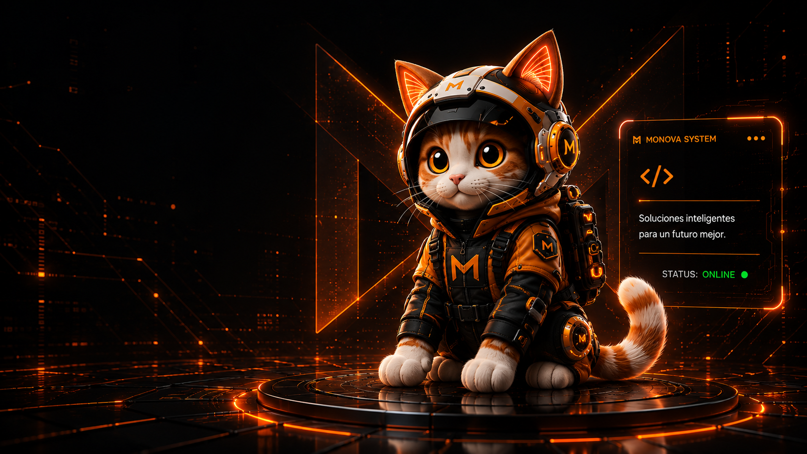

# MONOVA

<p align="center">
  <strong>AI Software Studio · Enterprise Automation</strong>
</p>

<p align="center">
  Sistemas de IA con estética premium y poder real. Creamos agentes inteligentes, plataformas a medida y automatizaciones para empresas que quieren operar más rápido, vender mejor y verse inolvidables.
</p>

<p align="center">
  
</p>

---

## ✨ Descripción

MONOVA es un estudio digital que combina **software**, **diseño**, **branding** e **inteligencia artificial**. Este repositorio contiene el sitio web oficial con un asistente AI integrado que diagnostica necesidades de negocio y propone soluciones personalizadas.

### 🚀 Stack Tecnológico

| Categoría | Tecnologías |
|-----------|-------------|
| **Frontend** | HTML5, CSS3 (vanilla), JavaScript (ES6+) |
| **Backend** | Node.js (ESM, HTTP Server nativo) |
| **AI** | OpenAI Responses API (`gpt-4.1-mini`) |
| **Animaciones** | Canvas API, Intersection Observer, CSS custom properties |
| **Tipografía** | Inter, Space Grotesk (Google Fonts) |
| **Despliegue** | Node.js server |

### 📄 Páginas

- **Inicio** (`index.html`) — Hero con partículas canvas, boot sequence animado, laboratorio interactivo de IA
- **Servicios** (`servicios.html`) — Desarrollo, IA, UX/UI, Cloud, Integraciones, Branding
- **Proyectos** (`proyectos.html`) — Portafolio de casos
- **Nosotros** (`nosotros.html`) — Equipo y filosofía
- **Blog** (`blog.html`) — Artículos y recursos
- **Contacto** (`contacto.html`) — Formulario de contacto

### 🎨 Características Frontend

- Animaciones canvas con partículas interactivas
- Efecto de "boot sequence" al cargar
- Cursor personalizado con trail de chispas
- 3D card tilt con seguimiento del mouse
- Botones magnéticos
- Scroll reveal con Intersection Observer
- Modales dinámicos para servicios
- Modo oscuro premium con acento naranja
- Diseño responsive y fully accessible

### ⚙️ Características Backend

- Servidor HTTP estático con soporte de rangos para video
- Chat assistant AI con contexto de negocio
- Generación de roadmaps con OpenAI
- Sistema de caché local con presets por keyword
- Protección contra path traversal

---

## 🛠️ Instalación

```bash
# 1. Clonar el repositorio
git clone https://github.com/Monova45/Monova.git
cd Monova

# 2. Instalar dependencias (solo si agregas más)
npm install

# 3. Configurar variables de entorno
cp .env.example .env
# Editar .env con tu OPENAI_API_KEY

# 4. Iniciar servidor
npm start
# → http://localhost:8000
```

## 🔐 Variables de Entorno

| Variable | Descripción | Default |
|----------|-------------|---------|
| `OPENAI_API_KEY` | API key de OpenAI | — |
| `OPENAI_MODEL` | Modelo de OpenAI | `gpt-4.1-mini` |
| `PORT` | Puerto del servidor | `8000` |

## 📁 Estructura

```
Monova/
├── assets/          # Imágenes, SVGs, videos, iconos
│   └── tech/        # Logos de tecnologías
├── index.html       # Página principal
├── servicios.html   # Servicios
├── proyectos.html   # Proyectos
├── nosotros.html    # Sobre nosotros
├── blog.html        # Blog
├── contacto.html    # Contacto
├── 404.html         # Página 404
├── styles.css       # Estilos globales
├── script.js        # Lógica frontend (modales, chat, roadmap)
├── animations.js    # Sistema de animaciones (canvas, cursor, scroll)
├── server.js        # Servidor Node.js + API OpenAI
├── .env.example     # Template de variables de entorno
└── package.json     # Configuración del proyecto
```

## 🤖 API Endpoints

### `POST /api/roadmap`
Genera un roadmap de 3 tarjetas para una idea de negocio.

```json
{
  "idea": "Quiero vender artesanías en línea"
}
```

### `POST /api/chat`
Chat asistente con contexto comercial de MONOVA.

```json
{
  "messages": [
    { "role": "user", "content": "Necesito un sistema de inventario" }
  ]
}
```

---

<p align="center">
  Hecho con ♠ por <strong>MONOVA</strong><br>
  <sub>Código. Diseño. Inteligencia. Pasión.</sub>
</p>
